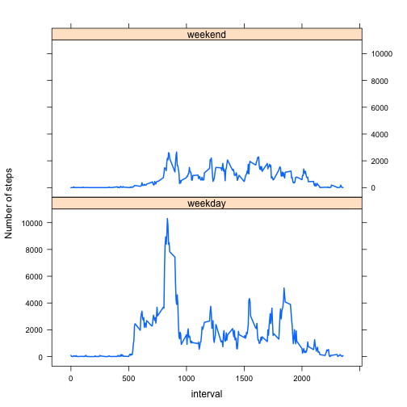

# Reproducible Research: Peer Assessment 1


## Loading and preprocessing the data

* Load the data


```r
myData <- read.csv("./activity.csv", header = T, colClasses = c("integer", "Date", "integer"))
```

* Process/transform the data into a format suitable for your analysis


```r
#Remove NA value
myData <- myData[which(myData$steps != "NA"), ]
```


## What is mean total number of steps taken per day?

* Make a histogram of the total number of steps taken each day


```r
dailyStep <- sapply(split(myData$steps, myData$date), sum)
hist(dailyStep)
```

 

* Calc and report the mean and median total number of steps taken per day


```r
#Calculation
dailyMean <- mean(dailyStep)
dailyMedian <- median(dailyStep)

#Report via markdown
```

The mean and median of daily steps is 1.0766 &times; 10<sup>4</sup> and 10765 respectively.

## What is the average daily activity pattern?

* Make a time series plot of 5-minute interval and average steps taken (all days)


```r
intAverage <- sapply(split(myData$steps, myData$interval), mean)
ints <- unique(myData$interval)
plot(x = ints, y = intAverage, type = "l", xlab = "5-minute intervals", ylab = "average number of steps")
```

 

* Which 5-minute interval contains the max of steps?


```r
intTotal <- sapply(split(myData$steps, myData$interval), sum)
intMax <- which.max(intTotal)
intMax <- ints[intMax]

#Report result via markdown
```

The answer is 835.

## Imputing missing values

* Calc & report the total number of missing values


```r
#rawData contains NA observations
rawData <- read.csv("./activity.csv", header = T, colClasses = c("integer", "Date", "integer"))
NACount <- nrow(rawData) - nrow(myData)

#Report result via markdown
```

There are 2304 NAs in data.

* Replacing NA


```r
#Replacing NAs using interval average
for (i in 1:nrow(rawData)){
    if(is.na(rawData$steps[i])){
        #There are 288 5-minute intervals in a day
        rawData$steps[i] <- intAverage[(i %% 288) + 1]
    }
}
```

* Create a new dataset with filled values


```r
newData <- rawData
```

*  Make a histogram of the daily total number of steps   
   Calc and report **mean** and **median** of daily steps  
   Do values differ from the first part?  
   What's the impact of filling NA?
   

```r
#Make a histogram
newDailyStep <- sapply(split(newData$steps, newData$date), sum)
hist(newDailyStep)
```

 

```r
#Calc the mean and median
newDailyMean <- mean(newDailyStep)
newDailyMedian <- median(newDailyStep)

#Report and answer the questions via markdown
```
** The new daily mean and median of steps are 1.0766 &times; 10<sup>4</sup> and 1.0766 &times; 10<sup>4</sup> respectively;  
** Which are equivalent with the old ones.

## Are there differences in activity patterns between weekdays and weekends?

* Create a factor with weekday and weekends


```r
weekEndDay<-function(x){
    #my system is Chinese, so the weekdays includes characters
    if(weekdays(x)  %in% c("星期六","星期日", "Saturday", "Sunday")){
        "Weekend"
    }
    else{
        "weekday"
    }      
}

weekend <- sapply(newData$date,weekEndDay)
newData <- cbind(newData,weekend)
```

* Make a panel plot ctning a time series plot of the 5-minute interval and the average number of steps in weekdays and weekends


```r
splited <- split(newData, newData$weekend)
d1<-splited$weekday
d2<-splited$Weekend
avrgPerInterval1<-sapply(split(d1$steps,d1$interval),sum,na.rm=T)
avrgPerInterval2<-sapply(split(d2$steps,d2$interval),sum,na.rm=T)
intervals<- unique(newData$interval)
data1 <- data.frame(steps=avrgPerInterval1,interval=intervals,nature="weekday")
data2 <- data.frame(steps=avrgPerInterval2,interval=intervals,nature="weekend")
nData <- rbind(data1,data2)
library("lattice")
xyplot(data=nData ,steps~interval|nature,layout=c(1,2),type="l",ylab="Number of steps",lwd=2)
```

 
